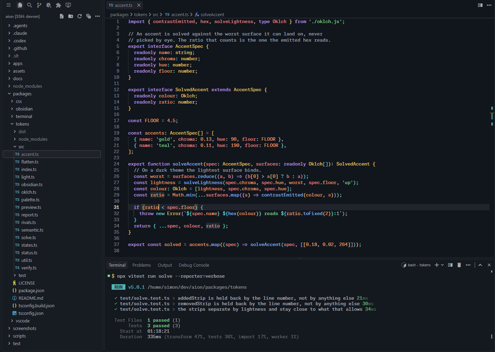
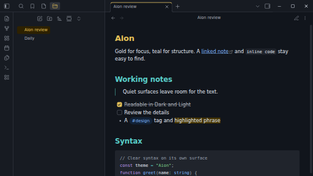
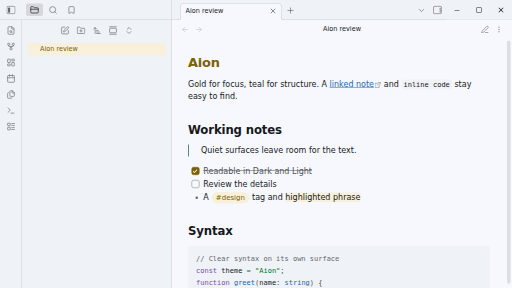

<p align="center">
  
</p>

<p align="center">
  <strong>A theme where your code is the deepest thing on the screen.</strong><br>
  Gold for focus, cool surfaces, the syntax colours your hands already know,<br>
  and a contrast floor that CI enforces. No italics. Dark and Light.
</p>

<p align="center">
  <a href="https://marketplace.visualstudio.com/items?itemName=sltsh.aion-theme"></a>
  <a href="https://open-vsx.org/extension/sltsh/aion-theme"></a>
  <a href="https://www.npmjs.com/package/@sltsh/aion-css"></a>
  <a href="LICENSE"></a>
</p>

<p align="center">
  <a href="#install">Install</a> ·
  <a href="https://aion.slt.sh/#sample">Live preview</a> ·
  <a href="https://aion.slt.sh/palette.html">Full palette</a> ·
  <a href="https://aion.slt.sh/#essentials">Copy colours</a> ·
  <a href="docs/LIGHT.md">Aion Light</a>
</p>

<p align="center">
  
</p>

```bash
code --install-extension sltsh.aion-theme
```

Then pick **Aion** or **Aion Light** from **Preferences: Color Theme**.

## Why Aion

**Your code sits deepest.** In Aion the editor is the darkest surface. The sidebar,
activity bar and status bar are raised one step above it, and the panel sits between the
two, so the eye settles on the code rather than on the chrome around it. Of the four
themes compared here, two do the opposite and two paint both one colour:

| Theme | Editor | Sidebar | Order |
|---|---|---|---|
| One Dark Pro | `#282c34` | `#21252b` | sidebar below editor |
| Ayu Mirage | `#242936` | `#1f2430` | sidebar below editor |
| Nord | `#2e3440` | `#2e3440` | one surface |
| Catppuccin Mocha | `#1e1e2e` | `#1e1e2e` | one surface |

**Nothing to relearn.** Syntax follows the One Dark Pro role map: functions are blue,
strings green, keywords violet, types gold. Each hue is solved again in OKLCH so that it
clears its floor in every reading state the gate covers. Gold is the signature everywhere else: the
cursor, the focus ring, the search hit and the active tab.

**The contrast floor is a gate, not a claim.** Every colour is checked against the surface
it sits on, including under a current-line highlight, a selection, a word highlight and a
diff fill, composited the way the renderer composites them. CI runs the gate on every
branch, so a colour below its floor cannot ship.

Here is the lowest of eight syntax roles on a plain editor line, against each theme's own
editor background:

| Theme | Lowest ratio | Below 4.5:1 | Source |
|---|---|---|---|
| Aion | 6.95 | none | — |
| One Dark Pro | 3.73 | comment, variable | [One Dark Pro](https://github.com/Binaryify/OneDark-Pro/blob/main/themes/OneDark-Pro.json) @ `54c3280` |
| Ayu Mirage | 3.42 | comment | [Ayu Mirage](https://github.com/ayu-theme/vscode-ayu/blob/master/ayu-mirage.json) @ `444ef92` |
| Nord | 2.43 | comment, number | [Nord](https://github.com/nordtheme/visual-studio-code/blob/develop/themes/nord-color-theme.json) @ `8ead098` |
| Catppuccin Mocha | 5.81 | none | [Catppuccin Mocha](https://github.com/catppuccin/vscode/blob/main/packages/catppuccin-vsc/src/theme/tokens/index.ts) @ `befc9e6` |

That compares eight colours on one background, read on 2026-09-05 at the revision named;
it is not a measure of accessibility or usability. Comments are the usual casualty, and in
Aion they stay quiet without going faint.

<details>
<summary>What the gate checks</summary>

| What the gate checks | Count |
|---|---:|
| Rows measured | 1057 |
| Below their floor | 0 |
| Exempt rows, all documented | 5 |
| Reading states per syntax colour | 35 |
| Lowest ratio in a reading state | 4.50:1 |
| Interface keys the theme sets | 623 |
| TextMate rules | 64 |
| Semantic tokens | 32 |

The gate covers a named set of reading states, not every state an application can
produce, and every exemption is documented. [§3.1 of the design specification](DESIGN.md#31-the-states-the-floor-covers)
lists each state and the foreground that reads worst on it. Every table in this README is
generated from the token package, so the copy cannot drift from what ships.

</details>

## Install

| Use Aion in | Get started |
|---|---|
| **VS Code** | `code --install-extension sltsh.aion-theme`, or install from the [Marketplace](https://marketplace.visualstudio.com/items?itemName=sltsh.aion-theme). |
| **Cursor, Windsurf, VSCodium** | Search for **Aion** in the extensions view; it is published to [Open VSX](https://open-vsx.org/extension/sltsh/aion-theme). |
| **Obsidian** | [Install from the community directory](https://community.obsidian.md/themes/aion), or follow the [manual steps](packages/obsidian/README.md). |
| **Windows Terminal** | [Download aion.json](https://aion.slt.sh/downloads/aion.json) and follow the [terminal guide](packages/terminal/README.md). |
| **Herdr** | Merge the theme from the [terminal guide](packages/terminal/README.md#herdr) into your config. |
| **CSS / Tailwind** | `npm install @sltsh/aion-css`; see the [CSS package](packages/css/README.md). |
| **Anything else** | The [portable colour-mapping guide](docs/APP-THEMING.md) maps every role for native editors, desktop tools and dashboards. |

The extension ships both **Aion** and **Aion Light**, and the npm packages expose both
palettes. The integrated terminal uses a matching ANSI set whose bright eight are
byte-identical to the syntax accents.

## Aion Light

Aion Light keeps the dark theme's roles rather than inverting its values. The editor is
the cleanest, lightest canvas, supporting surfaces deepen around it, and every syntax hue
is solved again for a light background. Gold stays the interaction accent and comments
stay quiet. The [Light guide](docs/LIGHT.md) covers its design and availability.

## Beyond the editor

The same palette carries into Obsidian, in both modes:

<table>
  <tr>
    <td></td>
    <td></td>
  </tr>
</table>

The [public site](https://aion.slt.sh) is built on `@sltsh/aion-css` and switches between
both palettes, and the [palette reference](https://aion.slt.sh/palette.html) lists every
colour with its role.

The name comes from the Ancient Greek αἰών: an age, an epoch, a span of existence.

## Contributing

Bug reports and ports are welcome. For a rendering issue, include the app version, a
screenshot and the steps to reproduce it. Colours are defined once in OKLCH and generated
everywhere else, so a palette change starts in `packages/tokens`. See
[CONTRIBUTING.md](CONTRIBUTING.md) for the repository layout, commands and release process.

## Licence

MIT. Archivo and Monaspace Neon are SIL OFL 1.1; see `apps/lab/public/fonts/LICENSE.txt`.
