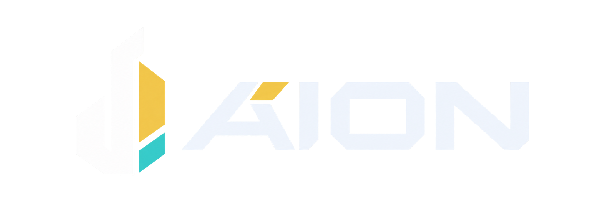

<p align="center">
  
</p>

<p align="center">Dark and light themes for editors and the web, with matching terminal colours.<br>Gold accents, cool surfaces, familiar syntax. No italics.</p>

<p align="center">
  <a href="https://aion.slt.sh">Explore Aion</a> ·
  <a href="LIGHT.md">Aion Light</a> ·
  <a href="https://aion.slt.sh/#essentials">Copy colours</a> ·
  <a href="#install">Install</a> ·
  <a href="https://aion.slt.sh/palette.html">Full palette</a>
</p>

## A familiar place to work

Aion follows the One Dark Pro syntax role map, with gold for focus and navigation and
teal as a secondary accent. The dark editor is the darkest surface; the raised sidebar
and panels keep the workspace easy to read. Aion Light is tuned independently for light
surfaces and generated alongside the dark VS Code theme.

Explore the [live code preview](https://aion.slt.sh/#sample) to see the palette in use.
The name comes from the Ancient Greek αἰών: an age, an epoch, a span of existence.

## Aion Light

Aion Light preserves the dark theme's roles rather than inverting its values. Its editor
is the cleanest, lightest canvas; supporting surfaces deepen gradually, and the familiar
syntax hues are solved again for light backgrounds. Gold remains the interaction accent,
violet remains primarily syntax, comments stay deliberately quiet, and there are no
italics.

Read [the Light variant guide](LIGHT.md) for its design philosophy, implementation,
current availability and native-acceptance status.

## Install

Aion `0.3.1` is available from npm, the Visual Studio Marketplace and Open VSX. That
published extension contains the dark theme; the refined Light theme is complete on
`main` and will reach those channels with the next tagged release. npm `0.3.1` contains
the earlier Light token and CSS APIs, not the refined palette documented here.

| Use Aion in      | Get started                                                                                                                                             |
| ---------------- | ------------------------------------------------------------------------------------------------------------------------------------------------------- |
| VS Code          | Run `code --install-extension sltsh.aion-theme` for the published theme. To try **Aion Light** before its next tagged release, run `npm ci` and `npm run pack:dev`, then use **Extensions → Install from VSIX** with the generated package. |
| Windows Terminal | [Download aion.json](https://aion.slt.sh/downloads/aion.json), then follow the steps below.                                                             |
| CSS / Tailwind   | Run `npm install @sltsh/aion-css`; build from `main` to use the refined Light palette before its next tagged release. See the [CSS package](packages/css/README.md). |
| Another app      | Follow the [portable colour-mapping guide](APP-THEMING.md) for native editors, desktop tools and dashboards. |

For Windows Terminal, save `aion.json` in
`%LOCALAPPDATA%\Microsoft\Windows Terminal\Fragments\sltsh` (create the folder if needed).
Restart Terminal, then select **Aion** under **Settings → Profiles → Appearance → Colour
scheme**. The [terminal guide](packages/terminal/README.md) also covers manual settings.

## Built for readable code

Syntax, interface text and decorations are checked against their intended surfaces.
The contrast gate runs in CI and blocks colours below their floor. It covers a named set
of reading states, not every state an application can produce; see the
[design specification](DESIGN.md#31-the-states-the-floor-covers) for the scope and exemptions.

<details>
<summary>Contrast measurements and theme comparisons</summary>

| Theme            | Editor    | Sidebar   | Order                |
| ---------------- | --------- | --------- | -------------------- |
| One Dark Pro | `#282c34` | `#21252b` | sidebar below editor |
| Ayu Mirage | `#242936` | `#1f2430` | sidebar below editor |
| Nord | `#2e3440` | `#2e3440` | one surface |
| Catppuccin Mocha | `#1e1e2e` | `#1e1e2e` | one surface |

**The contrast floor is a gate, not a claim.** Every token is defined in OKLCH and checked
against the surface it sits on, decorations composited the way the renderer composites
them. `npm run verify` exits non-zero on a token below its floor, and CI runs it on every
branch, so a colour below the floor cannot be released. The gate covers a named set of
reading states, not every state a renderer can produce; §3.1 of `DESIGN.md` is the set,
and three kinds of exemption are documented.

| What the gate checks             |  Count |
| -------------------------------- | -----: |
| Rows measured | 1057 |
| Below their floor | 0 |
| Exempt rows, all documented | 5 |
| Reading states per syntax colour | 35 |
| Lowest ratio in a reading state | 4.50:1 |
| Interface keys the theme sets | 622 |
| TextMate rules | 64 |
| Semantic tokens | 32 |

| Theme            | Lowest ratio | Below 4.5:1       | Source                                                                                                                           |
| ---------------- | ------------ | ----------------- | -------------------------------------------------------------------------------------------------------------------------------- |
| Aion | 6.95 | none | — |
| One Dark Pro | 3.73 | comment, variable | [One Dark Pro](https://github.com/Binaryify/OneDark-Pro/blob/main/themes/OneDark-Pro.json) @ `54c3280` |
| Ayu Mirage | 3.42 | comment | [Ayu Mirage](https://github.com/ayu-theme/vscode-ayu/blob/master/ayu-mirage.json) @ `444ef92` |
| Nord | 2.43 | comment, number | [Nord](https://github.com/nordtheme/visual-studio-code/blob/develop/themes/nord-color-theme.json) @ `8ead098` |
| Catppuccin Mocha | 5.81 | none | [Catppuccin Mocha](https://github.com/catppuccin/vscode/blob/main/packages/catppuccin-vsc/src/theme/tokens/index.ts) @ `befc9e6` |

Eight syntax roles on a plain editor line, against each theme's own editor background,
read on 2026-09-05 at the revision named. Every table here is generated: `npm run
sync:design` rewrites them from the token package and the emitted theme, so the copy
cannot drift from the emitter. This compares eight colours, not accessibility and not
usability.

</details>

The dark and light VS Code themes are generated from their complete scheme palettes and
share the same selectors and semantic-token names. Their contrast guarantees are
calculated over the named renderer states; native editor rendering remains a separate
acceptance check after a palette change.

## Contributing

Bug reports and port contributions are welcome. For a rendering issue, include the app
version, a screenshot, and the steps needed to reproduce it. For palette changes, edit
the OKLCH source in `packages/tokens`; generated colours should never be edited by hand.

## Packages

| Package             | What it ships                                                                      |
| ------------------- | ---------------------------------------------------------------------------------- |
| `packages/tokens`   | `@sltsh/aion-tokens` — both scheme palettes, OKLCH definitions and the build gate  |
| `packages/vscode`   | the VS Code extension: Aion, Aion Light, their gates and scope fixtures            |
| `packages/terminal` | the dark Windows Terminal fragment and settings snippet                            |
| `packages/css`      | both schemes as custom properties and a Tailwind v4 `@theme` block                 |
| `apps/lab`          | the surface gallery: five surfaces, one palette, six live sliders                  |
| `apps/site`         | the public site at https://aion.slt.sh: the landing page and the palette reference |

## Commands

```bash
npm install
npm run build       # every package emits its artefact
npm test            # every workspace, plus the release and bootstrap tests at the root
npm run typecheck
npm run verify      # the contrast gate; exits non-zero on any failure
npm run sync:design # regenerates the generated tables in DESIGN.md and both READMEs
npm run dev -w ./apps/lab   # the surface gallery on http://localhost:8421
npm run dev -w ./apps/site  # the public site on http://localhost:8422
```

CI runs the same gate on every branch and pull request under Node 22 and Node 24, and
fails when a build or a `sync:design` changes a tracked file. A `v*.*.*` tag publishes.

## Release and deployment

Pushes to `main` run CI and deploy `apps/site` to GitHub Pages. The lab remains local,
and the site's Light palette stays hidden until its `lightVisible` flag is enabled.

A version tag is the package release trigger. Before tagging, move the changelog section,
set the same version in all four package manifests, update the CSS token dependency and
refresh the lockfile. The release workflow rebuilds and rechecks the repository, then:

- publishes `@sltsh/aion-tokens` and `@sltsh/aion-css` to npm;
- publishes one VSIX containing Aion and Aion Light to the Visual Studio Marketplace and
  Open VSX;
- creates the GitHub release with the VSIX and generated notes.

The Windows Terminal fragment remains a repository and site download; it is not published
to npm. See [RELEASING.md](RELEASING.md) for setup, dry-run and tag instructions.

## Documents

- `DESIGN.md` — the specification. Every table in it is generated.
- `LIGHT.md` — the Light variant's philosophy, implementation and availability.
- `PLAN.md` — the order of work, what is done, and every defect the code found.
- `RELEASING.md` — the secrets, the tag procedure and the dry run.

## Rules

Do not edit a hex value by hand anywhere in this repository. Change the OKLCH definition
in `packages/tokens` and rebuild. If a document and the emitted values disagree, the
emitted values are right and the document is stale; run `npm run sync:design`.

## Licence

MIT. Archivo and Monaspace Neon are SIL OFL 1.1; see `apps/lab/public/fonts/LICENSE.txt`.
