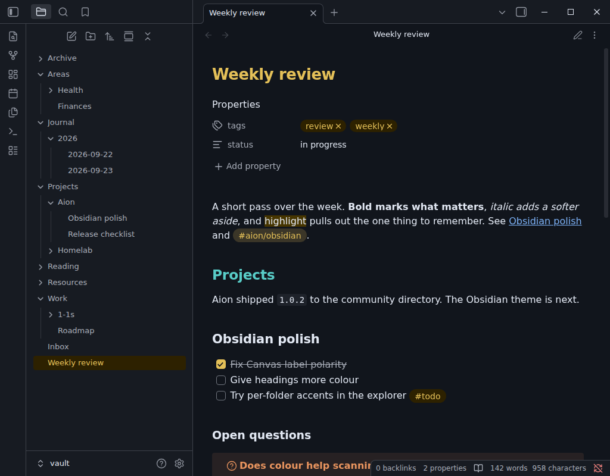
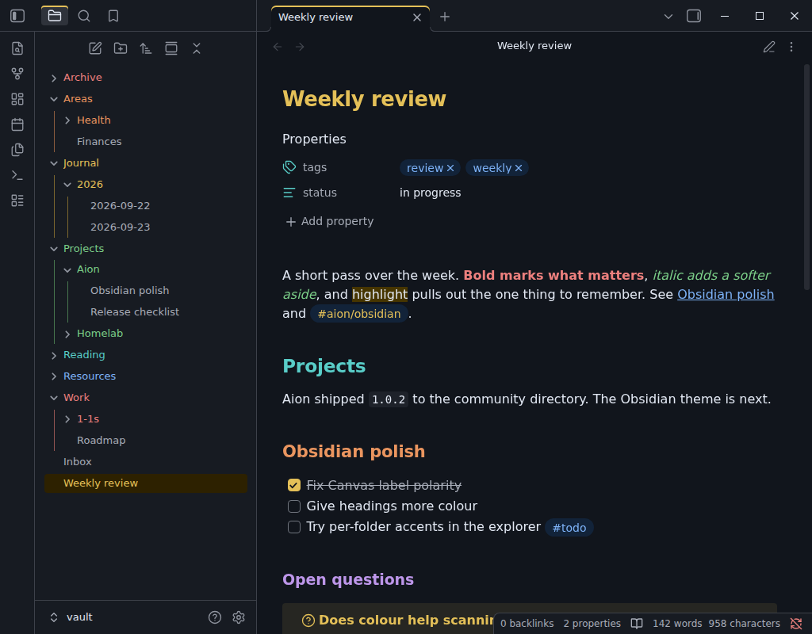
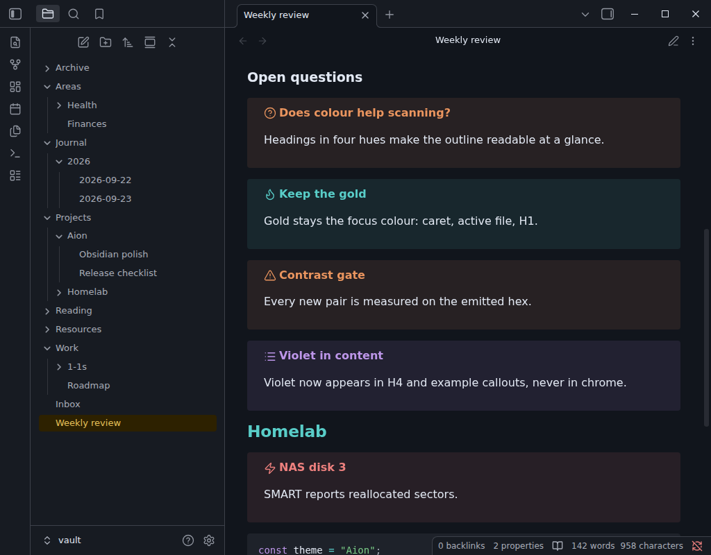
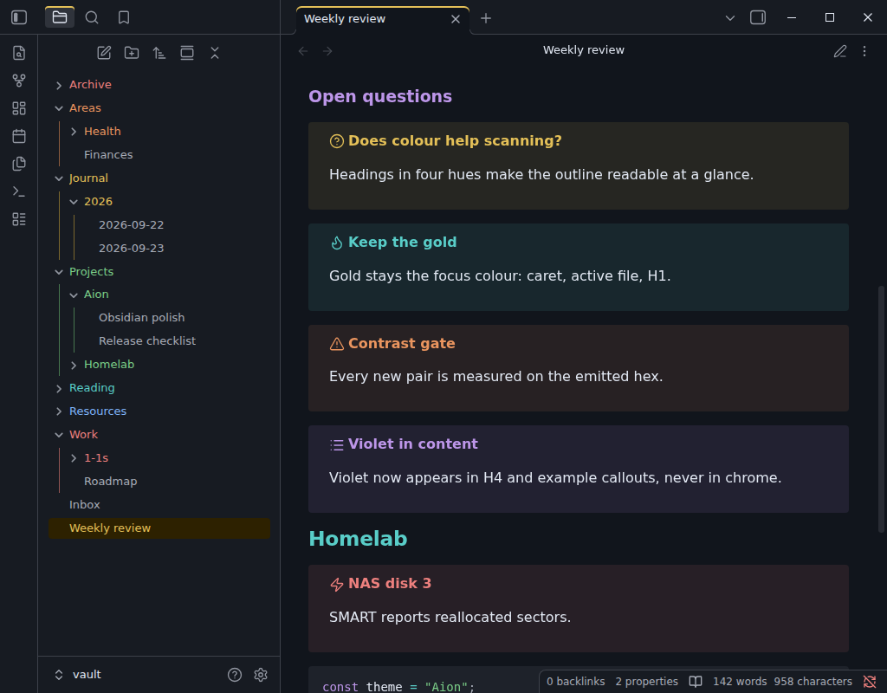
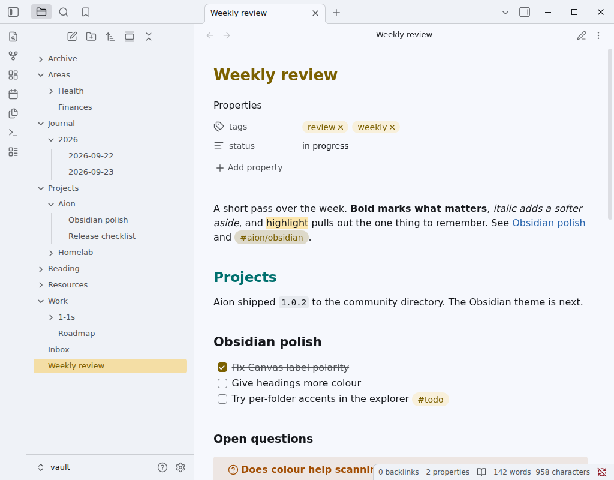
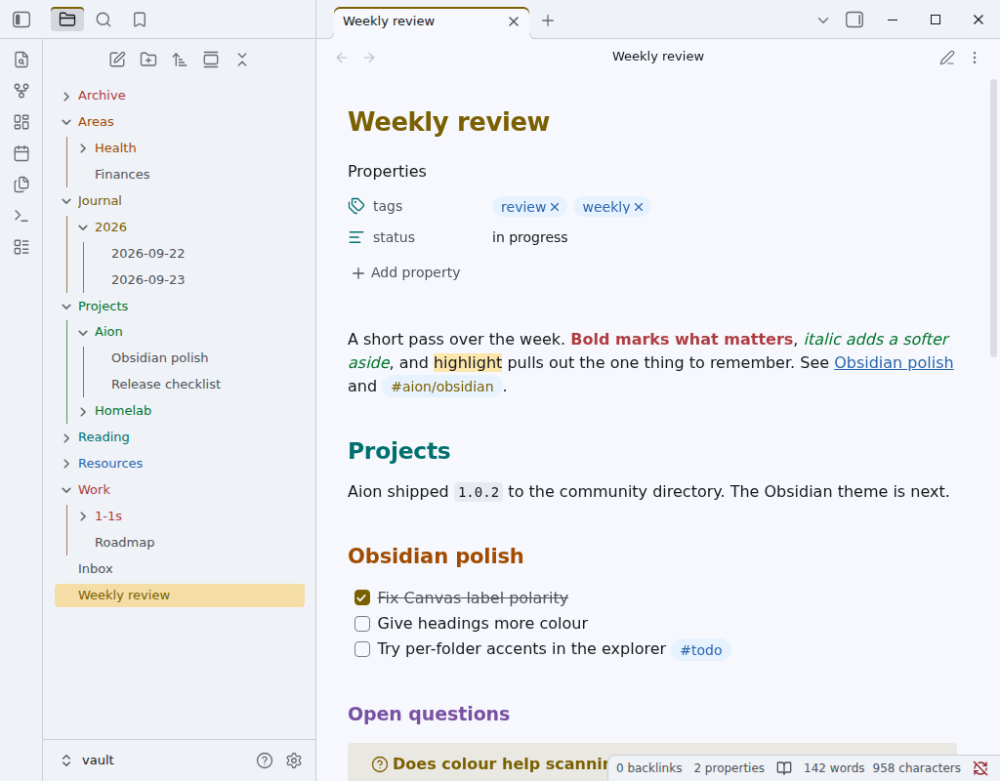
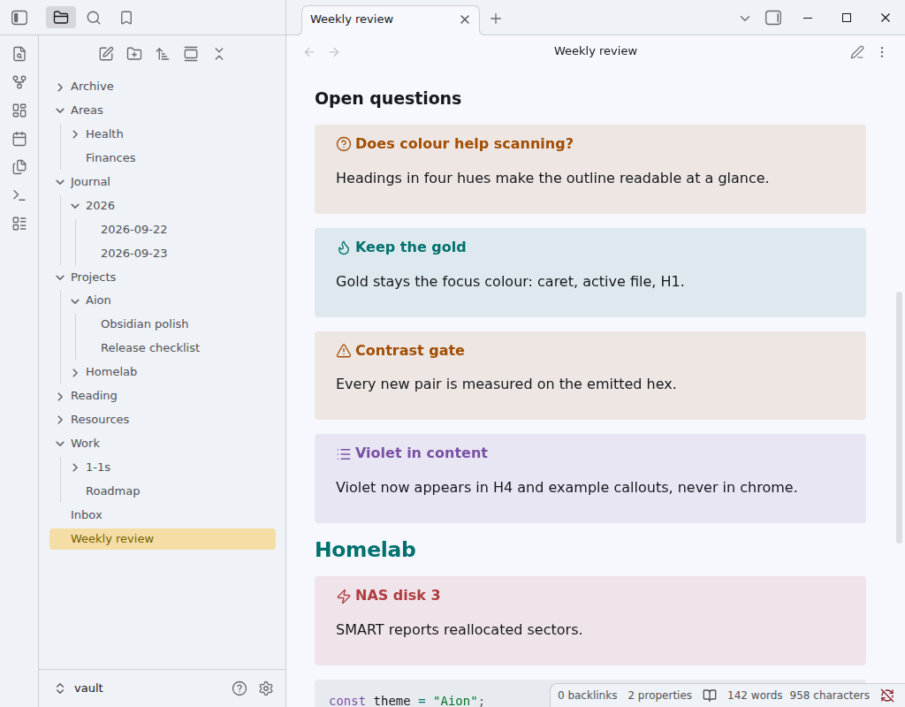
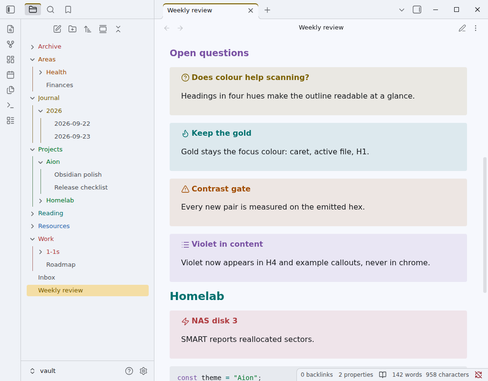
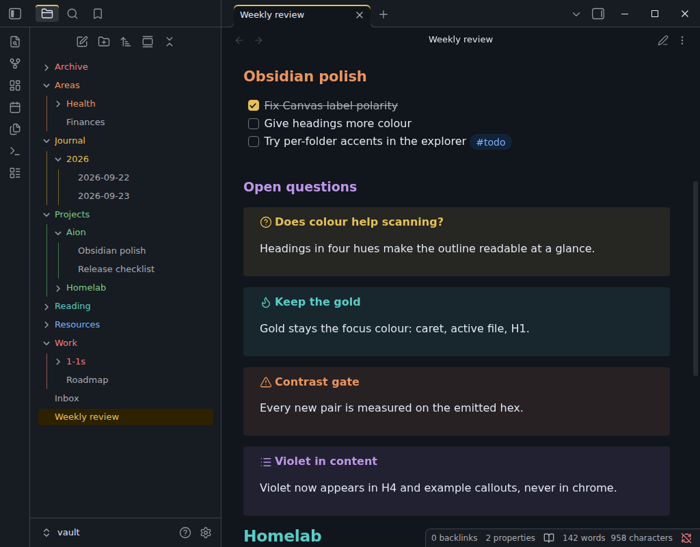
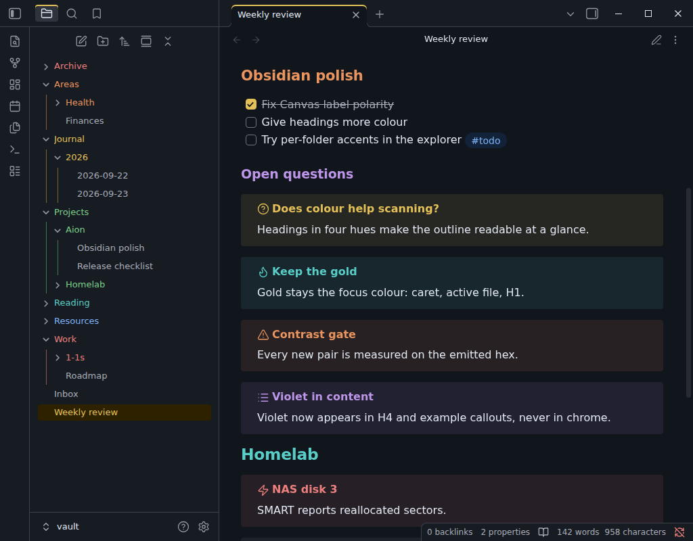

# Obsidian: more colour, same Aion — design proposal

Status: **proposal, awaiting review.** Nothing here has changed `packages/obsidian` or the
shipped `theme.css`. The captures below are Obsidian 1.13.7 on Linux (Xvfb, 1024×800,
reading view) rendering the current `theme.css` plus a prototype CSS snippet generated from
`@sltsh/aion-css`. They are native renders of a prototype, not of a shipped build.

## Goal

The Dark and Light themes read as correct but flat: only H1 (gold) and H2 (teal) carry
colour, bold and italic are plain text, every tag is gold, and the file explorer is one
grey column. Coming from Catppuccin, the missing thing is **scanning by colour**: telling
heading levels, emphasis, tags and folders apart without reading them.

Keep Aion's character: the seven existing accents only, gold as the focus colour, the
editor as the darkest surface, no italics added by the theme, violet out of chrome.

Decided in review:

| Question | Answer |
|---|---|
| Heading colour | H1–H4 coloured, H5/H6 stay neutral |
| Explorer | Each top-level folder takes the next accent; its subtree inherits it |
| Violet | Allowed in note content, never in chrome |
| Scope | Headings, explorer, bold/italic/highlight, callouts, tags, tabs/ribbon/status bar, content spacing |

## Before and after

### Dark

| Current | Proposed |
|---|---|
|  |  |
|  |  |

### Light

| Current | Proposed |
|---|---|
|  |  |
|  |  |

## Proposed changes

### 1. Headings: H1–H4 in alternating warm and cool

| Level | Now | Proposed | Why |
|---|---|---|---|
| H1 | gold | gold | Signature colour, unchanged; also the inline title |
| H2 | teal | teal | Unchanged: "gold for focus, teal for structure" |
| H3 | primary text | **copper** | Warm again, so neighbouring levels never share a temperature |
| H4 | primary text | **violet** | Content-only use of violet, as agreed |
| H5 | primary text | primary text | Deep levels stay calm |
| H6 | secondary text | secondary text | |

Alternating warm/cool gives every adjacent pair the largest hue jump available, which is
what makes a level recognisable without reading the size.

### 2. Bold, italic and highlight

- `--bold-color` → **coral**, `--italic-color` → **green**. Emphasis becomes findable
  when skimming, the way Catppuccin's does.
- Highlight keeps its current fill. Bold coral on the dark highlight measures **4.51:1**,
  just over the floor; it is the tightest pair in the proposal and gets its own test.
- This is the loudest change. If it feels busy after a week, the fallback is bold coral
  and italic left as primary text.

### 3. Tags: blue pills instead of gold

`--tag-color` blue on `--tag-background` blue subtle. Gold tags sat next to the gold
highlight and the gold active file and read as the same thing; blue separates "metadata"
from "emphasis". Links stay the blue underline, so a tag (pill) and a link (underline)
still differ in shape.

### 4. Callouts: one change

Obsidian 1.13 already derives callout colours from `--color-*`, so callouts are already in
Aion hues (see the "Current" captures). The only defect is that **question** and
**warning** both resolve to copper. Proposed: `--callout-question` → **gold**. Everything
else stays as Obsidian maps it (example is already violet today).

### 5. File explorer: per-folder accent

Top-level folders cycle **coral → copper → gold → green → teal → blue**, then repeat.
Violet is excluded because the explorer is chrome.

- The folder name and its chevron take the accent; nested folder names inherit it.
- The indentation guide for that subtree uses the accent's **border** step, so the colour
  runs down the tree quietly.
- Files stay neutral text. The active file keeps today's gold row.
- **On hover the folder name falls back to neutral text.** Light accents on the hover row
  measure 4.10–4.15:1, under 4.5:1, and DESIGN.md already rules that hover rows use neutral
  text. The chevron and guide keep the colour, so the folder stays identifiable.

Top-level files (such as `Inbox`) stay neutral. The cycle follows Obsidian's own sort,
so renaming or reordering a folder can change its colour. That is the cost of doing this
without a plugin or per-folder configuration.

### 6. Chrome: small gold marks

- Active tab in the main area: a 2px gold top edge.
- Active side-panel icon and hovered ribbon icon: gold.
- Property icons: teal.
- Status bar: secondary text and a hairline top border, no colour.

Chrome stays almost entirely neutral. Gold marks where you are, nothing else.

## Content spacing

Aion sets no spacing today; everything is Obsidian's default. Measured in reading view at
16px text:

| Measure | Value | Verdict |
|---|---|---|
| Line length | 624px, about 70–75 characters | Good |
| Line height | 1.5 | Good |
| Paragraph gap | 16px | Good |
| Space above any heading after body text | 40px for **every** level | Flat: an H4 breaks the page as hard as an H2 |
| Heading sizes H2 / H3 / H4 | 23.4 / 21.1 / 19.0px | Close together, so the gaps and colours carry the hierarchy |
| Callout padding top / title-to-body / bottom | 12 / 16 / **28**px | Unbalanced: the last paragraph's margin leaks into the box |
| Explorer row | 25px | Good |
| List item | 26px | Good |

| Current | Proposed |
|---|---|
|  |  |

Proposed:

1. **Graded heading space**: H2 keeps `--heading-spacing` (40px), H3 gets 0.8× (32px),
   H4–H6 0.6× (24px). Written against Obsidian's own selector and variable, so the user's
   density and font settings still scale it.
2. **Balanced callouts**: remove the last child's bottom margin and use 8px between title
   and body. Result: 12 / 8 / 12px. Each callout is 24px shorter, and a stack of four
   no longer reads as a wall.

Font size, line height and line width are left alone. The Obsidian README promises that
the user's font and density settings stay in control.

## Contrast

Calculated with `contrastEmitted` on the emitted hex. Callout titles are composited with
`compositeEmitted` at Obsidian's 10% fill. These are calculations, not native acceptance.

| Pair | Dark (min) | Light (min) |
|---|---|---|
| Any accent as text on the page (headings, bold, italic) | 6.96 (coral) | 5.55 (blue) |
| Folder accents on the sidebar | 6.57 (coral) | 5.26 (blue) |
| Folder accents on the hover row | 4.82 (coral) | **4.10, so hover uses neutral text** |
| Tag text on tag fill (blue) | 7.23 | 5.21 |
| Callout title on its own fill | 6.05 (coral) | 4.80 (copper) |
| Bold (coral) / italic (green) on highlight | 4.51 / 6.23 | 4.81 / 4.83 |

## Implementation outline

All of this lives in `packages/obsidian/src/theme.ts`; no token changes and no new hex.

- **Variables** in `obsidianColors`: `--h3-color`, `--h4-color`, `--bold-color`,
  `--italic-color`, `--tag-color`, `--tag-background`, `--callout-question`, plus
  per-accent `--aion-obsidian-folder-*` values (solid and border) for the explorer cycle.
- **Rules** appended to `themeCss`, in the style of the existing Canvas rules:
  - explorer cycle, `nav-folder:nth-child(6n+k of .nav-folder)`, setting a folder custom
    property that the title, chevron and indentation guide read
  - hover fallback to `--nav-item-color-hover`
  - active tab edge, ribbon and side-panel icon colour, property icon, status bar
  - heading spacing and callout balance
- **Tests** in `packages/obsidian/test/theme.test.ts`, each pairing a foreground with the
  background it lands on: heading colours and bold/italic on the page, bold/italic on the
  composited highlight, folder accents on the sidebar, tag on tag fill, question title on
  its composited fill. A test also asserts that no explorer or chrome rule references
  violet.
- Then `npm run build`, `npm run verify`, `npm test`, `npm run typecheck`,
  `npm run sync:design`, re-capture `screenshots/obsidian-*.png`, and a native check in
  Obsidian of reading view, **Live Preview** and Source mode. The spacing rules target
  reading view and have not yet been checked in Live Preview. Update the Obsidian README,
  which currently says headings and tags keep "authored palette roles", and add a
  CHANGELOG entry.

## Open for your review

1. Bold coral + italic green, or bold only?
2. Explorer cycle order: rainbow (proposed) or maximum-contrast neighbours
   (e.g. coral, teal, gold, blue, copper, green)?
3. Should the Obsidian accent picker also recolour the heading ladder, or stay as today,
   where headings are fixed palette roles?
