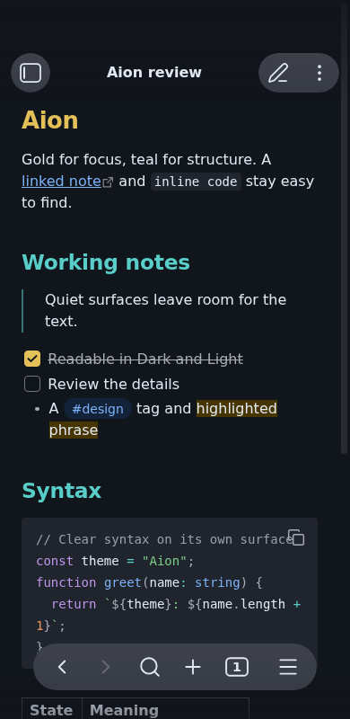
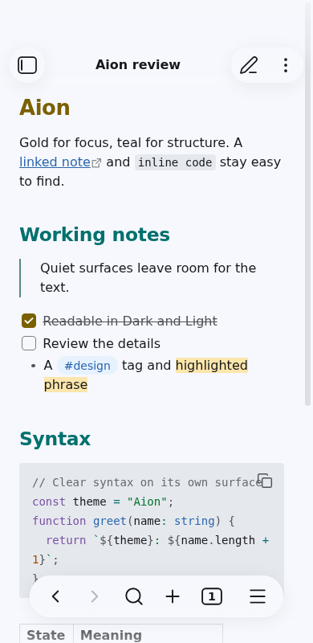

# Aion for Obsidian

One community theme with **Dark** and **Light** modes. The repository-root
[`theme.css`](../../theme.css) and [`manifest.json`](../../manifest.json) are the files
Obsidian loads; this package generates the CSS from Aion's emitted palette. Do not edit
colors in the generated sheet. Change `packages/tokens/src` and rebuild.

### Phone layout preview

These captures use Obsidian's [built-in mobile emulation](https://docs.obsidian.md/Plugins/Getting%20started/Mobile%20development)
at a 390px viewport. They are not screenshots from an Android or iOS device.

## Install from Obsidian

Open **Settings → Appearance → Themes → Manage**, search for **Aion**, and select
**Install and use**. Switch **Base color scheme** between **Dark** and **Light** to use
both variants.

## Install manually

1. In your vault, create `.obsidian/themes/Aion/`.
2. Download `manifest.json` and `theme.css` from the [1.0.2 Obsidian release](https://github.com/sltsh/aion/releases/tag/1.0.2) into that folder.
3. In Obsidian, open **Settings → Appearance → Themes** and select **Aion**.
4. Switch **Base color scheme** between **Dark** and **Light** to see both variants.

The theme maps Obsidian's documented variables for surfaces, controls, text, Markdown,
code, navigation, tabs and dialogs. It does not ship fonts, images, scripts or remote
imports. Your existing font and density settings remain in control.

## Build and release

From the repository root, run `npm run build -w @sltsh/aion-obsidian` after building the
token and CSS packages. The normal `npm run build` handles dependency order. The root
test suite checks that the committed CSS matches its generator, both variants contain
the same keys, and selected reading and focus pairs clear their contrast floors.

The repository-root manifest and stylesheet were published in the 1.0.2 Obsidian release.
The screenshots above were captured directly from Obsidian 1.13.7 with an
isolated local vault. Desktop reading, live preview, and source mode were checked in both
modes; Dark in-note search, file menus, and the command dialog were also checked. The
built-in phone emulator showed both variants in reading and Source mode, Dark Live Preview
and note menu, Light navigation, and Appearance settings in both variants. Android and iOS
hardware remain unchecked.
The [Obsidian submission guide](https://docs.obsidian.md/themes/app-themes/submit-theme)
also requires a community listing submission after the GitHub release.
